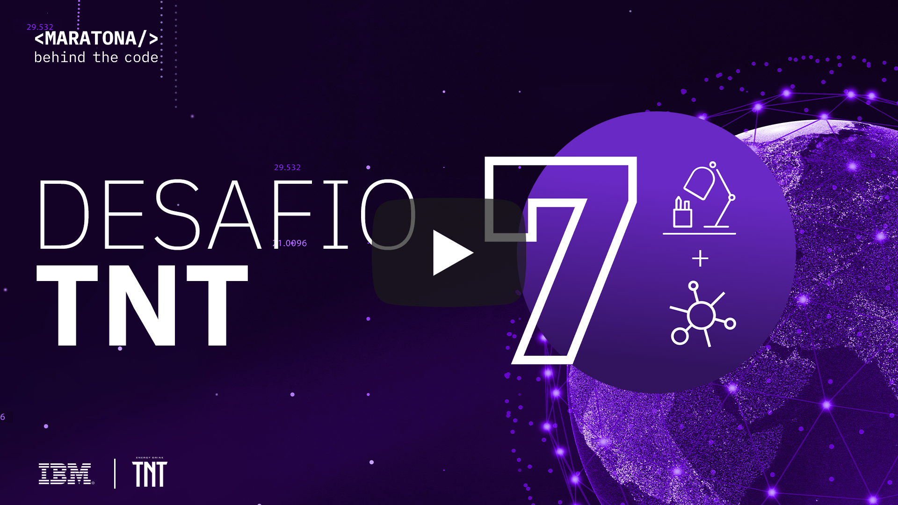

[](https://cloud.ibm.com)
<a href="https://discord.gg/2NRPpcU">
</a>

# Desafio 07 | TNT

- [1. Sobre a TNT](#1-sobre-a-tnt)
- [2. Desafio de negócio](#2-desafio-de-negocio)
- [3. Objetivo](#3-objetivo)
- [4. Desenvolvendo a Solução](#4-desenvolvendo-a-solucao)
  - [4.1. Tecnologia do desafio](#42-tecnologia-do-desafio)
  - [4.2. Pré-requisitos](#41-pré-requisitos)
  - [4.3. Resumo das tarefas](#43-resumo-das-tarefas)
  - [4.4. Desenvolvimento](#43-desenvolvimento)
- [5. Submissão](#5-submissão)
- [6. Sobre a avaliação](#6-sobre-a-avaliação)

## Para te ajudar

- [Material de Apoio](#material-de-apoio)
- [Em caso de dúvidas](#em-caso-de-duvidas)
- [License](#license)

## 1. Sobre a TNT

### 1.1. Introdução

A marca TNT está presente em 20 estados brasileiros, principalmente nas regiões Sul e Sudeste. Produzido em Teresópolis/RJ, está entre os três energéticos mais consumidos no Brasil e é comercializado nas seguintes versões: Original, Açaí com Guaraná, Citrus, Pêssego, Maçã Verde, Tangerina e Zero Açúcar. Pioneiro, foi o primeiro energético brasileiro a utilizar o selo higiênico e permanece o único.
#PODEVIR
@TNTEnergyDrink 

<div align="center">
    <a href="https://www.youtube.com/watch?v=VjzIJggHPBI&feature=youtu.be">
       
    </a>
</div>

### 1.2. Premiação

A marca TNT vai premiar os TOP 4 do seu desafio e o TOP 1 do ranking geral da Maratona Behind the Code em português com um kit especial para cada ganhador contendo um **computador gamer**, uma **caixa térmica exclusiva repleta de produtos TNT**, **mochila TNT** e **munhequeira TNT**.  

## 2. Desafio de negócio

O mercado de energéticos vem crescendo ano após ano, muito impulsionado por mudanças no hábito de consumo do brasileiro, o que antigamente era um produto apenas de mixologia, passou a ser um produto de consumo diário por conta das suas funcionalidades.

Com esse crescimento e novos hábitos de consumo, os pontos de vendas ganharam uma atenção ainda maior, uma vez que, os produtos precisam estar à disposição do cliente nos momentos que eles necessitam dessas funcionalidades.

Negociações comerciais com grandes redes de varejo necessitam de muitos esforços de investimentos e nem sempre é o momento que o cliente mais necessita do produto.
Como desafio, TNT Energy Drink quer propor uma opção de utilização das vending machines como PDV nos momentos que os clientes mais necessitam (Metrôs, Academias etc.).

Cada vending machine servirá como um grande banco de dados fornecendo informações em tempo real de quantidade de produtos, possibilitando o melhor controle de estoque, recomendação de reabastecimentos, melhores pontos de vendas, etc. 

## 3. Objetivo

Os desenvolvedores deverão utilizar IBM Watson Studio, e IoT na IBM Cloud para criar um modelo preditivo capaz de alertar momento ideal que será necessária uma nova recarga de uma máquina de venda automática de TNT. Os participantes deverão se conectar a dispositivos IoT para receber os dados de estoque das máquinas em tempo real, e ajudar a empresa na reposição, onde a máquina de venda automática somente será visitada quando houver a necessidade de reabastecimento, poupando gastos desnecessários.

## 4. Desenvolvendo a solução

### 4.1. Tecnologia do desafio

Veja no vídeo abaixo uma explicação completa dos passos necessários para resolução desse desafio.

<div align="center">
    <a href="https://youtu.be/qi-pf7pEzEA">
       
    </a>
</div>

No video abaixo uma forma de ler os dados de IoT do Broker MQTT, e de como utilizá-lo com Pandas no Jupyter Notebook.

<div align="center">
    <a href="https://youtu.be/yT_DIEu6uzA">
       
    </a>
</div>

### 4.2. Pré-requisitos

Para realizar esse desafio você deverá cumprir os seguintes pré-requisitos:

- Registrar-se na [Maratona Behind the Code](https://ibm.biz/maratona) e confirmar seu e-mail de cadastro.
- Possuir uma conta na [IBM Cloud](https://ibm.biz/registro-maratona), podendo ser a conta FREE ou pay-as-you-go (não é necessário registrar-se no evento com o mesmo e-mail utilizado para criar sua conta na IBM Cloud).

### 4.3. Resumo das tarefas

1. Se conectar ao broker IoT e adquirir os dados de consumo e abastecimento dos pontos de venda
2. Formatar os dados em um aquivo csv
3. Importar os dados em [notebook.ipynb](./notebook.ipynb) e modelar
4. Compactar o arquivo `results.csv` e `notebook.ipynb` em arquivo zip (pode usar qualquer nome).
5. Acessar [https://tnt.maratona.dev/](https://tnt.maratona.dev/) e realizar sua submissão.

### 4.4. Desenvolvimento

O desafio será dividido em duas partes. A primeira parte se refere a aquisição dos dados. A segunda é relativo a modelagem dos dados adquiridos na etapa anterior.

A TNT, em conjunto com a organização da Maratona criou um dispotivo IoT que está publicando dados referentes ao seus postos de venda num tópico. Os dados publicados pelo dispotivo IoT formaram a base necessária para construir a segunda parte do desafios. O Dispotivo ficará ligado até o fim da Maratona e basta apenas uma hora para você adiqurir todos os dados. Junto dos dados vai vir um indice para saibam quando a base começar a se repetir.

Para adiquirir os dados será necessário se conectar ao seguinte endereço por meio do protocolo `MQTT` com a seguinte configuração:

```bash
HOST: tnt-iot.maratona.dev
PORT: 30573
USERNAME: maratoners
PASSWORD: ndsjknvkdnvjsbvj
```

Para adquirir os dados é necessário "ouvir" o tópico `tnt`, e eles vão vir no seguinte formato.

```josn
{
  "row": 2000,
  "Tempo": "aaaa-mm-dd",
  "Estação": "metro",
  "LAT": "Latitude",
  "LONG": "Longitude",
  "Movimentação": 123123,
  "Original_473": 100,
  "Original_269": 100,
  "Zero": 100,
  "Maçã-Verde": 100,
  "Tangerina": 100,
  "Citrus": 100,
  "Açaí-Guaraná": 100,
  "Pêssego": 100,
  "TARGET": "status"
}
```

Um vez de posse de todos os dados você deverá formatar eles num arquivo csv de modo que a primeira linha seja cobeçalho do aquivo e o restante somente com os dados adquiridos pelo dispositivo IoT, como mostra o formato abaixo.

```csv
Tempo,Estação,LAT,LONG,Movimentação,Original_473,Original_269,Zero,Maçã-Verde,Tangerina,Citrus,Açaí-Guaraná,Pêssego,TARGET
2010-1-1,Corinthians-Itaquera,-21.0163,-48.7739,70277,86,65,65,43,43,43,43,43,NORMAL
2010-1-1,Palmeiras-Barra Funda,-21.0163,-48.7800,70376,86,65,65,43,43,43,43,43,NORMAL
...
```

Com os dados formatados em csv, chegou a hora de criar um modelo de aprendizado de máquina capaz de identificar a partir de qual quantidade de produtos no ponto de vendas é necessário reabastecimento. Para isso, foi fornecido o notebook [notebook.ipynb](./notebook.ipynb) contendo as intruções necessária a modelagem. Fique a vontade para criar novas variáveis e colunas no dataset obtido, pois, semelhante ao [desafio 6](https://github.com/maratonadev-br/desafio-6-2020), neste desafio não será necessário fazer o deploy da solução no Watson Machine Learning, contudo, você deverá preencher a coluna `TARGET` da planilha results.csv utilizando o seu modelo.

Com o aquivo results.csv devidamente preendchido voce deve compactá-lo junto com o seu notebook da seguinte forma e com os respectivos nomes:

```bash
meu_zip.zip
|-results.csv
|-notebook.ipynb
```

## 5. Submissão

Para realizar a submissão, primeiramente você deverá acessar a seguinte aplicação: https://tnt.maratona.dev/ e preencher o formulário, inserindo seu email cadastrado na Maratona Behind The Code e fazer o upload do arquivo zip. Após realizar a submissão você deverá confirmar a submissão por meio de um email enviado pela organização.


## 6. Sobre a avaliação

O sistema testará se o seu modelo foi capaz de inferir corretamente cada linha da planilha `results.csv` de acordo com as métricas existentes de modelos de aprendizado de máquina.

## Material de apoio

- [Documentação jupyter notebook](https://jupyter.org/)
- [Documentação Pandas](https://pandas.pydata.org/)
- [Documentação Scikit-Learn](https://scikit-learn.org/stable/)
- [MQTT](https://pt.wikipedia.org/wiki/MQTT)
- [Python Paho](https://github.com/eclipse/paho.mqtt.python)
- [Nodejs mqtt](https://github.com/mqttjs/MQTT.js/)

Você também pode acessar o discord oficial da Maratona 2020 para realizar perguntas e/ou interagir com outros participantes: [Discord](https://discord.gg/2NRPpcU).

## License

Copyright 2020 Maratona Behind the Code

Licensed under the Apache License, Version 2.0 (the "License");
you may not use this file except in compliance with the License.
You may obtain a copy of the License at

       http://www.apache.org/licenses/LICENSE-2.0

Unless required by applicable law or agreed to in writing, software
distributed under the License is distributed on an "AS IS" BASIS,
WITHOUT WARRANTIES OR CONDITIONS OF ANY KIND, either express or implied.
See the License for the specific language governing permissions and
limitations under the License.
